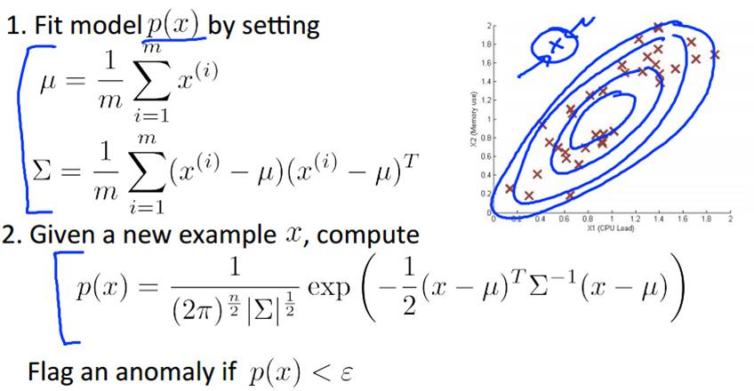
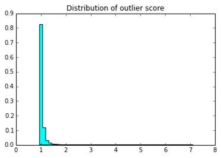

# Anomaly(Outlier)Dection                                     Mark Lin @MLEng Team *Transwarp*
## Definition
* Hawkins - Outlier:
An outlier is an observation that deviates so much from other observations as to arouse suspicion that it was generated by a different mechanism.

## Applications of Anomaly Detection
* Network intrusion detection
* Insurance / Credit card fraud detection
* Healthcare Informatics / Medical diagnostics
* Industrial Damage Detection
* Image Processing / Vedio surveillance
* ...
## Key Challengs
* Defining a representative normal region is challenging
* The boundary between normal and outlying behavior is often not precise
* The exact notion of an outlier is different for different application domains
* Availability of labeled data for training / validation
* Data might contain noise
* Normal behavior keeps evolving
## Contents
* Graphical Approach: Box-plot
* Statistic Approach: Univariate / Multivariate Gaussion Distribution
* Distance-based Approach
* Density-based Approach: LOF
* Model-based Approach: Isolation Forest， RNN
## Box-plot
* The bottom and top of the box are the first and third quartiles
* The band inside the box is the second quartile (the median)
* The lowest datum within 1.5 IQR of the lower quartile, and the highest datum within 1.5 IQR of the upper quartile

## Contents
* Graphical Approach: Box-plot
* Statistic Approach: Univariate / Multivariate Gaussion Distribution
* Distance-based Approach
* Density-based Approach: LOF， RNN
* Model-based Approach: Isolation Forest
## Statistical Approach
* General idea
	* Given a certain kind of statistical distribution (e.g., Gaussian)
	* Compute the parameters assuming all data points have been generated by such a statistical distribution (e.g., mean and standard deviation)
	* Outliers are points that have a low probability to be generated by the overall distribution
* Basic assumption
	* Normal data objects follow a (known) distribution and occur in a high probability region of this model
	* Outliers deviate strongly from this distribution
## Univariate Gaussian Distribution
1. Choose a feature xj that might be indicative of anomalous examples.
2. Fit parameters u1, ..., un, σ12，..., σn2

3. Given new example x, compute p(x):

4. Anomaly if p(x) < ε

## Multivariate Gausssian Distribution

## Problems
* Mean and standard deviation are very sensitive to outliers.
* These values are computed for the complete data set(including potential outliers).
* It is hard to choose a good  ε.
* Data distribution is unknown.
## Contents
* Graphical Approach: Box-plot
* Statistic Approach: Univariate / Multivariate Gaussion Distribution
* Distance-based Approach
* Density-based Approach: LOF， RNN
* Model-based Approach: Isolation Forest
## Distance-basd Approach
* General idea
	* Judge a point based on the distance to its neighbors
* Basic assumption
	* Normal data objects have a dense neighborhood
	* Outliers are far apart from their neighbors, i.e., have a less dense neighborhood
* Compute the distance between every pair of data points
* There are various ways to define outliers:
	* Data points for which there are fewer than p neighboring points within a distance D
	* The top n data points whose distance to the kth nearest neighbor is greatest
	* The top data points whose average distance to the k nearest neighbors is greatest
## Problems
* Its assumption does not always work in all situations.
* Computing the distance between every pair of instances is quite       expensive.
* Curse of Dimensionality.

## Contents
* Graphical Approach: Box-plot
* Statistic Approach: Univariate / Multivariate Gaussion Distribution
* Distance-based Approach
* Density-based Approach: LOF
* Model-based Approach: Isolation Forest， RNN
## Local Outlier Factor
* General idea
	* Compare the density around a point with the density around its local neighbors
	* The relative density of a point compared to its neighbors is computed as an outlier score
* Basic assumption
	* The density around a normal data object is similar to the density around its neighbors
	* The density around an outlier is considerably different to the density around its neighbors
## K-distance of an Object p
For any positive integer k, the k-distance of object p, denoted as k-distance(p), is defined as the distance d(p, o) between p and an object o ∈ D such that:
(i) for at least k objects o'∈ D \ {p} it holds that d(p, o') ≤ d(p, o) and
(ii) for at most k-1 object o' ∈ D \ {p} it holds that d(p, o')＜d(p, o) 

Given the k-distance of p, the k-distance neighborhood of p contains every object whose distance from p is not greater than the k-distance, i.e. Nk-distance(p)(p) = { q ∈ D \ {p} | d(p, q) ≤ k-distance(p)}.
These objects q are called the k-nearest neighbors of p.
## Reachability Distance of an Object p w.r.t. Object o
Let k be a natural number. The reachability distance of object p with respect to object o is defined as
reach-distk(p, o) = max { k-distance(o), d(p, o) }.

## Distribution of Outlier Score

It can be observd that, the optimal outlier score threshold to decide whether a data-point is outlier or not is around 2 for most of the cases.

## Summary
* compute the (euclidean) distances between every object and other objects in the dataset. O(n2) 
* rank the (euclidean) distances.O(nlogn) (nearest neighbor problem)
* compute the reachability distance of each object. 
* compute the local reachability density of each object.
* compute the local outlier factor of each object.
# spark-lof

## Visulization

## Problems
* Exponential runtime
* Curse of dimensionality
## Contents
* Graphical Approach: Box-plot
* Statistic Approach: Univariate / Multivariate Gaussion Distribution
* Distance-based Approach
* Density-based Approach: LOF
* Model-based Approach: Isolation Forest, RNN
## Isolation Forest
Most existing anomaly detection approaches construct a profile of normal instances, then identify anomalies as those that do not conform to the normal profile.Their anomaly de-tection abilities are usually a ‘side-effect’ or by-product of an algorithm originally designed for a purpose other than anomaly detection (such as classification or clustering).
This leads to two major drawbacks: 
(i) these approaches are not optimized to detect anomalies—as a consequence, these approaches often under-perform re-sulting in too many false alarms (having normal instances identified as anomalies) or too few anomalies being detected; 
(ii) many existing methods are constrained to low dimensional data and small data size because of the legacy of their original algorithms.

Assumption:
Isolation Forest detects anomalies by isolating instances, without relying on any distance or density measure.
i) they are the minority consisting of few instances, and
ii) they have attribute-values that are very different from those of normal instances.
Isolation can be implemented by any means that separates instances.

## Isolation Tree
Let T be a node of an isolation tree. T is either an external-node with no child, or an internal-node with one test and exactly two daughter nodes (Tl, Tr). A test at node T consists of an attribute q and a split value p such that the test q < p determines the traversal of a data point to either Tl or Tr.
## Isolation Forest: Training Stage

## Isolation Forest: Evaluation Stage

## Isolation Forest: Anomaly Score

