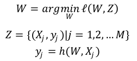
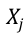
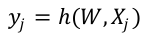
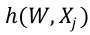
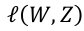
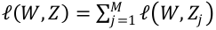

# Factorization Machines & Online Optimization

## Outline
+ Online Optimization
  - TG
  - FOBOS
  - RDA
  - FTRL
+ Factorization Machines
  - Model
  - Training

## Outline Learning

+ Online Learning 是工业界比较常用的机器学习算法,在很多场景下都能有很好的效果。
+ Online Learning 能够根据线上反馈数据,实时快速地进行模型调整,使得模型及时反映线
上的变化,提高线上预测的准确率。
+ Batch Learning vs. Online Learning
   + Batch Learning 更新模型的周期较长,

     Online Learning 能够实时更新模型。
   + Batch Learning 对硬件资源要求高,

     Online Learning 对硬件资源要求低。
   + Batch Learning 假设样本服从 IID 分布,

     Online Learning 对样本分布无要求。

## 最优化问题
+ 通常最优化问题可以形式化地表示为:

+ 其中, Z是观测样本集合(训练集),是第 j 个样本的特征向量, 是第j个样本的预测值。是特征向量到预测值的映射函数。是最优化求解的目标函数,即损失函数,通常表示为为各个样本损失函数的累加,即。W是特征权重,也就是需要求解的参数。

