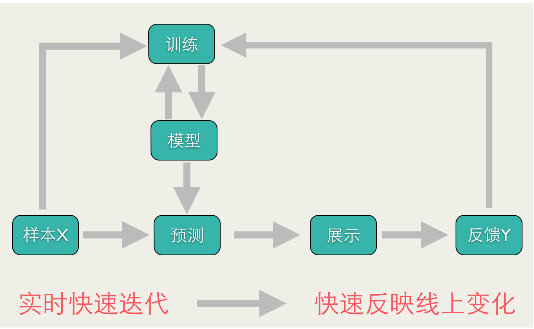

# Factorization Machines & Online Optimization

## Outline
+ Online Optimization
  - TG
  - FOBOS
  - RDA
  - FTRL
+ Factorization Machines
  - Model
  - Training

## Outline Learning

+ Online Learning 是工业界比较常用的机器学习算法,在很多场景下都能有很好的效果。
+ Online Learning 能够根据线上反馈数据,实时快速地进行模型调整,使得模型及时反映线
上的变化,提高线上预测的准确率。
+ Batch Learning vs. Online Learning
   + Batch Learning 更新模型的周期较长,

     Online Learning 能够实时更新模型。
   + Batch Learning 对硬件资源要求高,

     Online Learning 对硬件资源要求低。
   + Batch Learning 假设样本服从 IID 分布,

     Online Learning 对样本分布无要求。

## 最优化问题
+ 通常最优化问题可以形式化地表示为:

+ 其中, Z是观测样本集合(训练集),是第 j 个样本的特征向量, 是第j个样本的预测值。是特征向量到预测值的映射函数。是最优化求解的目标函数,即损失函数,通常表示为为各个样本损失函数的累加,即。W是特征权重,也就是需要求解的参数。

## Batch/Stochastic Gradient Descent

## 模型稀疏性的好处
+ 特征选择,易于解释
+ 减少模型预测的时间复杂度,降低存储模型的空间占用
+ 更加符合奥卡姆剃刀原理

## 如何在 Online Learning 中得到稀疏模型?
+ 简单截断法
+ 截断梯度法(TG)
+ FOBOS算法
+ RDA算法
+ FTRL算法

### 简单截断法
+ 以k为窗口,当t/k不为整数时采用标准的SGD进行迭代,当t/k为整数时,采用如下权重更新方式:

+ 这种方法实现起来很简单 , 也容易理解。但实际中 ( 尤其在 OGD 里面 )W 的某个系数比较小可能是因为该维度训练不足引起的,简单进行截断会造成这部分特征的丢失。

### 梯度截断法（TG）
+ TG 同样是以 k 为窗口,每 k 步进行一次截断。当 t/k 不为整数时 λ (t) = 0 ,当 t/k 为整数时 λ (t) = kλ 。从下面公式可以看出, λ 和 θ 决定了 W 的稀疏程度,这两个值越大,则稀疏性越强。尤其令 λ = θ 时 , 只需要通过调节一个参数就能控制稀疏性。

### 简单截断法和梯度截断法比较

### FOBOS算法
在 FOBOS 算法中,权重的更新分为两步:

前一个步骤实际上是一个标准的梯度下降步骤,后一个步骤可以理解为对梯度下降的结果进行微调。
观察第二个步骤,发现对 W 的微调也分为两部分 :
(1) 前一部分保证微调发生在梯度下降结果的附近 ;
(2) 后一部分则用于处理正则化,产生稀疏性。

### L1-FOBOS 算法

在L1的正则化下，有 。为简化，用向量 来表示 。用标量 来表示 。因此，可得， 

由于求和公式的每一项都大于等于零，所以可以按每一维度单独求解，

 

### RDA
在 RDA 中,权重的更新策略是

其中,线性项 包含之前所有梯度与 W 乘积的平均值,正则项 额外正则项，是一个非负且非递减序列, h(W) 是一个辅助的严格凸函数。

### L1—RDA

+ 在 L1-FOBOS 中,截断的判定条件是 
通常,定义  为与  正相关的函数。因此, L1-FOBOS 的截断阈值是,随着 t 的增加,这个阈值会逐渐降低。而, L1-RDA 中的截断阈值是一个常数,不随着 t 的变化而变化。因此,可以认为 L1-RDA 比 L1-FOBOS 在截断判定上更加 aggressive ,也就是说,更容易产生稀疏性。
+ 不同于 TG 和 L1-FOBOS 仅采用单次梯度对权重进行更新, L1-RDA 公式中包含了梯度的累加平均值,因此,可以避免某些维度由于训练不足导致被截断的问题,在精度和稀疏性上的表现更加均衡。

### FTRL

