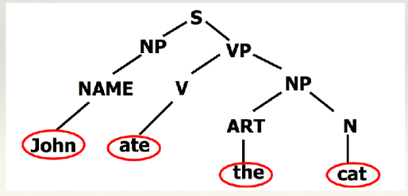
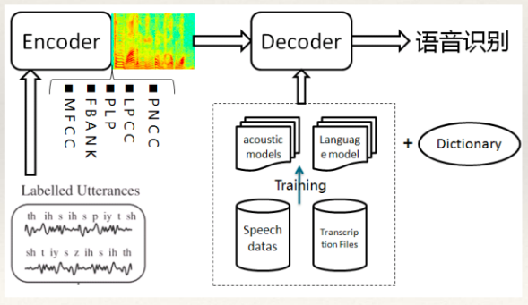
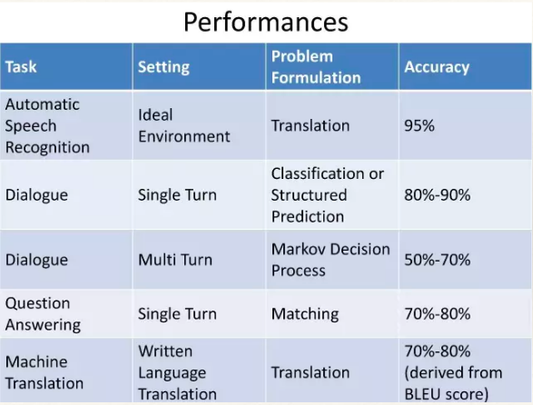

# 自然语言处理（nature language process)

## 目录
+ 基本概念
+ 研究的基本问题
+ 研究的主要内容
+ 面临的困难
+ 发展趋势
+ 参考资料

## 基本概念
+ 当我们进行任何一项研究的时候,总会关心两类问题:一是是什么,为什么;二是做什么,怎么做。这是科学与技术紧密相关的两个方面。
+ 自然语言处理既是一门技术也是一门学科。
+ 自然语言指人类使用的语言,如汉语、英语等
+ 语言是思维的载体,是人类交流的工具
+ 语言的两种属性:文字和声音
+ 人类历史上以文字形式记载和流传的知识占80%以上。
+ *自然语言处理的定义*：

    自然语言处理又称为自然语言理解,就是利用计算机为工具对人类特有的书面形式和又头形式的自然语言的信
息进行各种类型处理和加工的技术。- 冯志伟《自然语言的计算机处理》

## 研究的基本问题
__1. 语音学__

__语音学(Phonetics)问题__:研究词及其语音的关联

__2. 形态学__

__形态学(Morphology)问题__:研究词是如何由有意义的基本单位-词素(Morphemes)构词的。

+ 词素是从词或者词干的直接成分的角度来确定的音义结合体。字和词素不是一一对应的。一、有的汉字实际上代表不同的词素。如“副”这个字代表多种词素:“第二的、次级的”、“相配、相称”、某种计量单位。二、同一词素可以由不同的汉字来表示。如:“来吧”中的“吧”可以由“罢”代替。三、有些汉字在某些场合属于词素,某些场合不是。如:“沙”在“泥沙”里面是词素,在“沙发”里面不代表意义。词素与词的关系是“词素的功能是构词词”。词素构词 词有两种情况:一、一个词素单独构词一个词。如:人、鱼、书、蜈蚣等。二,两个或两个以上的词素构词一个词。如:人+民,机+器等。

__3. 语法学__

__语法学(Syntax)问题__:研究句子结构成分之间的相互关系和组成句子的序列。
+ 为什么一句话可以这么说也可以那么说?

__4. 语义学__

__语义学(Sementics)问题__：研究如何从一个语句中词的意义,以及这些词在该语句中句法结构中的作用来推导出
该语句的意义。
+ 下面的话说了什么?

(1)苹果不吃了

(2)这个人真牛

(3)火烧圆明园/火烧驴肉

__5. 语用学__

__语用学(Pragmatics)问题__:研究在不同上下文中的语句的应用,以及上下文对语句理解所产生的影响。从狭义的语言学观点看,语用学处理的是语言结构中有形式体现的那些语境。相反,语用学最宽泛的定义是研究语义
学未能涵盖的那些意义。
+ 在语用学中最基本的一个概念是语境,它是专门研究语言的理解和使用的
学问,它研究在特定场景中的特定话语,研究如何通过语境来理解和使用。
+ 下面话为什么这样说?

(1)火,火!

(2)A:看看鱼怎么样了? B:我刚才翻了一下。

## 研究内容

### 1. 机器翻译

+ __基于规则的机器翻译方法__认为翻译的过程是需要对源语言的分析和源语言意义的表示,然后再生成等价的标语言的过程。根据翻译过程的不同,规则方法可分为两种主要方法: 基于转换的方法的翻译过程包括三个阶段:分析得到一种源语言的抽象表示;把源语言的抽象表示转换为目标语言的抽象表示;由目标语言的抽象表示生成目标语言。基于中间语言的方法在对源语言分析后产生的是中间语言,而目标语言的生成是直接由这种中间语言开始的。
+ __基于实例的机器翻译__的本质是“以翻译实例为基础,基于相似原理的机器翻译”,其利 用的主要知识源是预处理过的双语语料和翻译词典。基于实例的翻译过程通常包括三步: 在翻译实例库中搜索匹配片段;确定相应的译文片段;重新组合译文片段以得到最终翻译。
+ __统计机器翻译__也是基于双语语料库的,但与基于实例的方法在翻译过程中直接使用翻译 实例不同,统计方法通过事先的训练过程将双语语料库中隐含的翻译知识抽象成统计模型, 而翻译过程通常就是基于这些统计模型的解码过程。
+ __神经机器翻译__。神经机器翻译与传统的统计机器翻译不同,神经机器翻译的目的是建立一个单一的神经网络,可以联合调整,以最大限度地提高翻译性能。最近提出的用于神经机器翻译的模型通常属于编码器 - 解码器族,且将源语句编码成固定长度向量,解码器从该向量生成翻译。

### 2. 信息检索
+ 信息检索(Information retrieval):信息检索也称为情报检索,
就是利用计算机从大量文档中找到符合用户需要的相关信息。
+ 面向多语言的信息检索称为跨语言的信息检索,如google,baidu等。
+ 早期的信息检索系统采用“布尔查询”的方法来进行全文检索。这种方法无疑将构造一个合适的查询的责任推到用户身上。用户必须详细的规划自己的查询,其复杂程度不亚于编程语言。这种检索方式并不提供任何的文档相关性测度,对于文档与查询的评价就只有“匹配”,“不匹配”两种而已。这两点问题决定了布尔查询不能被广泛应用。但是,由于布尔检索能够给用户提供更多的可控制性,今天我们仍然可以在搜索引擎的“高级搜索”中找到布尔查询的身影。
+ 对于大规模的语料库,任何检索都可能返回数量众多的结果,因此对检索结果进行排序是必须的。因此,一个好的信息检索模型必须提供文档相关性测度。一个好的测度应该使与用户查询需求最相关的那些结果,排在最前面,同时允许尽可能多的,与用户查询有一定关系的结果被包括进来。目前,最为常用的信息检索模型有三种:
  - 向量空间模型 (Vector Space Model, VSM)
  - 概率模型 (Probabilistic Model)
  - 推理网络模型 (Inference Network Model)

### 3. 自动文摘
+ TextRank 算法是一种用于文本的基于图的排序算法。其基本思想来源于谷歌的 PageRank算法, 通过把文本分割成若干组成单元(单词、句子)并建立图模型, 利用投票机制对文本中的重要成分进行排序, 仅利用单篇文档本身的信息即可实现关键词提取、文摘。
+ 传统的摘要生成系统大部分都是抽取型的, 这类方法从给定的文章中, 抽取关键的句子或者短语, 并重新拼接成一小段摘要, 而不对原本的内容做创造性的修改. 深度学习是一个生成方法,它会创造性的生成摘要。最新的方法是__神经注意力模型(Neural attention model)__。

### 4. 文档分类
+ 文档分类:其目的就是利用计算机系统对大量的文档按照一定的分类标准实现自动归类。
+ 文档分类的方法有基于机器学习的方法(如svm,decision tree)和基于深度学习(如cnn,rnn)的方法。
+ 流程:样本处理 — 特征选择 — 分类
+ 应用:图书管理、内容管理、情感分析等

### 5. 问答系统
+ 问答系统(Question answer system):通过计算机对人提出的
问题的理解,利用自动推理等手段,在有关知识资源中自动求解
答案并作出相应的回答。问答技术有时与语音技术、人机交互技
术等相结合,构成人机对话系统。
+ 问答系统模型通常分为基于检索的模型和基于生成的模型。
+ 基于检索的模型回答是提前定义的,使用规则引擎、正则匹配或
者深度学习训练好的分类器从数据库中挑选一个最佳的回复。
+ 基于生成的模型多使用深度学习的方法。最流行的方法是
sequence2sequence attention model。

### 6. 文字识别
+ 文字识别(Character Recognition):通过计算机系统对印
刷体或手写体等文字进行自动识别,将其转换为计算机
可以出来的电子文本。
+ 传统的文字识别方法就是特征工程+分类器的方法。深度
学习的方法主要有rcnn,yolo等。
+ 流程:预处理—特征提取和降维—分类器—后处理

### 7. 语音识别
+ 语音识别(Speech Recognition):将输入计算机的语音信
号转换成书面语表示。
+ 应用:文字录入、人机通讯、语音翻译等
+ 难点:大量存在同音词、近音词、集外词、又音等等。
+ 输入:美中贸易摩擦升级
+ 识别结果:美中贸易摩擦生机
+ 早期的语音识别系统主要采用隐马尔科夫模型来建模。
+ 现在的语音识别系统多采用end2end的方法。

### 8. 语音生成
+ 语音生成(speech generate):利用计算机将书面语转换为语音
信号。
+ 语音生成有两个主要目标:可理解性(intelligibility)和自然
感(naturalness)。可理解性是指合成音频的清晰度,特别
是听话人能够在多大程度上提取出原信息。自然感则描述了
无法被可理解性直接获取的信息,比如听的整体容易程度、
全局的风格一致性、地域或语言层面的微妙差异等等。
+ 百度的 Deep Voice、Yoshua Bengio 团队提出的 Char2Wav
以及谷歌的 Tacotron均在语音生成方面表现突出。

## NLP面临的困难
+ 语义歧义

    他说:“她这个真有意思(funny)”。她说:“他 这个 怪有意思
的(funny)”。于是 们以为他们有意思(wish),并让他向她
意思意思(express)。他 :“我根本没有那个意思
(thought)”!她也 :“你们这么说是 么意思(intention)”?事
后有 说:“真有意思(funny)”。也有说:“真没意思
(nonsense)”。
+ 存在未知的语言现象

    新的词汇,如专业术语、外来语、人名、机构名等

    新的含义,如打酱油、涨姿势、蓝瘦香菇、吃枣药丸等

    新的用法和语句结构。在又语和网络语中出现的“非规范”的语句结构。如“这届人民不行”、“扎心了老铁”。

## 发展趋势
    目前,人们主要通过两种思路来进行自然语言处理,一种是基于规则的理性主义,另外一种是基于统计的经验

主义。现实的情况是,统计学习方法越来越受到重视,自然语言处理中更多地使用机器自动学习的方法来获取语言

知识。

    深度学习在自然语言处理中的应用极大的促进了行业的发展。但是,即使使用深度学习,仍然有许多问题只能

达到基本的要求,如问答系统、对话系统、对话翻译等。

###参考资料
+ 自然语言理解.宗成庆
+ https://zh.wikipedia.org/wiki/
%E6%96%87%E6%9C%AC%E4%BF%A1%E6%81%AF%E6%A3%80%E7%B4%A2
+ https://www.zhihu.com/question/20398418
+ http://blog.csdn.net/tensorflowshizhan/article/details/69230070
+ http://www.leiphone.com/news/201702/4OZau7OfcNO0v1u5.html
+ http://blog.csdn.net/zbc1090549839/article/details/53055386
+ https://mp.weixin.qq.com/s?
__biz=MzI3MTA0MTk1MA==&mid=2651996872&idx=2&sn=de050c86b618862afe210aa3944
c2a57
+ https://blog.athelas.com/paper-1-baidus-deep-voice-675a323705df
+ http://daily.zhihu.com/story/4857231

