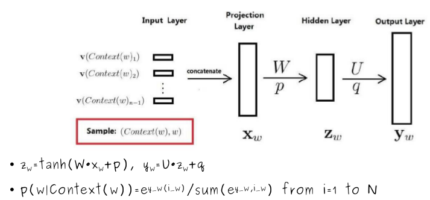
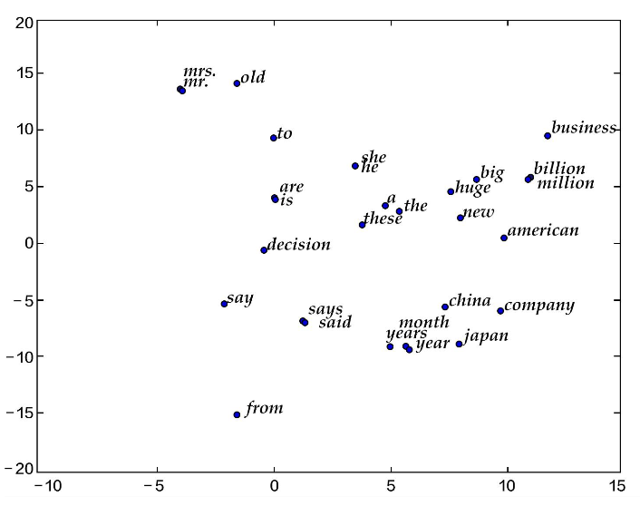
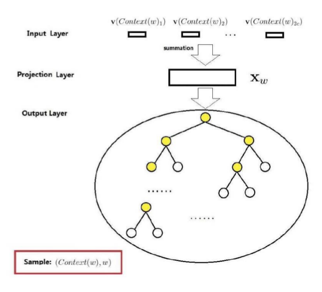
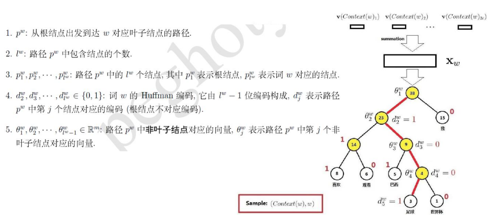

# Word2Vec

## Outline
+ 统计语言模型
+ 神经概率语言模型
+ 基于Hierarchical Softmax的CBOW模型
+ 基于Negative Sampling的Skip-gram模型

### 统计语言模型
+ __定义__:给定一个特定顺序的词串，统计语言模型计算该词串是一个有意义的句子的概率

    p(w 1 , w 2 ,..., w t )=p(w 1 )·p(w 2 |w 1 )· ... ·p(w t |w 1 , w 2 ,..., w t-1 )
+ __例子__:

    p("Today is Friday")≈0.001 > p("Today Friday is")≈0.00000001
+ __复杂度估计__:
  - 假设词典大小为N,句子的长度为t,则共有N t 种组合。每一种组合包含t个参
数,总共需要计算和存储t·N t 个参数。

#### N-Gram语言模型
+ __基本思想__:一个词出现的概率只与其前面n-1个词相关

  p(w k |w 1 ,w 2 ...w k-1 )≈p(w k |w k-n+1 ,w k-n+2 ,...,w k-1 )

  =p(w k-n+1 ,w k-n+2 ,...,w k )/p(w k-n+1 ,w k-n+2 ,...,w k-1 )

  ≈count(w k-n+1 ,w k-n+2 ,...,w k )/count(w k-n+1 ,w k-n+2 ,...,w k-1 )
+ __平滑化问题__:
  - 若count(w k-n+1 ,w k-n+2 ,...,w k )=0,能否认为p(w k |w 1 ,w 2 ...w k-1 )=0?
  - 若count(w k-n+1 ,w k-n+2 ,...,w k-1 )=count(w k-n+1 ,w k-n+2 ,...,w k ),能否认为
p(w k |w 1 ,w 2 ...w k-1 )=1?
### 神经概率语言模型

    其中,是词w的输出向量(长度为N),i_w是词w在词典中的位置,y_w(i_w)是输
出向量y_w上位于i_w的元素,N是词典的大小
#### 词向量比较
+ One-hot representation

__定义：__词向量的大小与词典大小相同,词向量中,只有该词对应位置的元素为1,其余为零
  - 优点:简单
  - 缺点:语义鸿沟,维数灾难
  - Distributed representation、

__定义：__低维稠密实向量
  - 优点:具有语义、语法相似性
  - 缺点:缺乏解释性,计算复杂

+ *复杂度估计*
 + w的上下文词的数量,通常不超过5
 + 词向量的长度,通常是10 1 -10 2 量级
 + 隐藏层神经元数量,通常是10 2 量级
 + 词典的大小N,通常是10 4 -10 5 量级

  整个模型的大部分计算集中在隐藏层和输出层的矩阵向量计算以及输出层中
  的softmax归一化!
### 基于Hierarchical Softmax的CBOW模型
+ 输入层:包含Context(w)中2c个词的词向量
+ 投影层:将输入层中2c个词向量求和累加
+ 输出层:是一棵二叉树,由词典中的词作为叶子节点,以各词在语料中出现的次数作为权值,构建出来的一棵Huffman树

Quiz：CBOW模型和神经概率语言模型相比,结构有什么区别?

