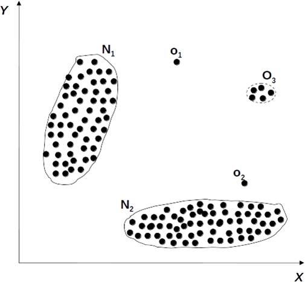
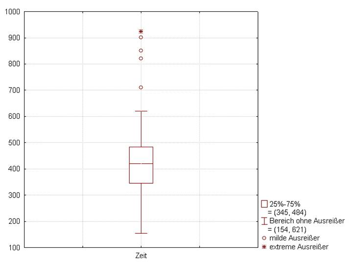
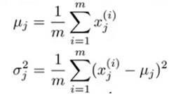
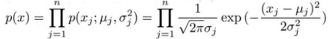
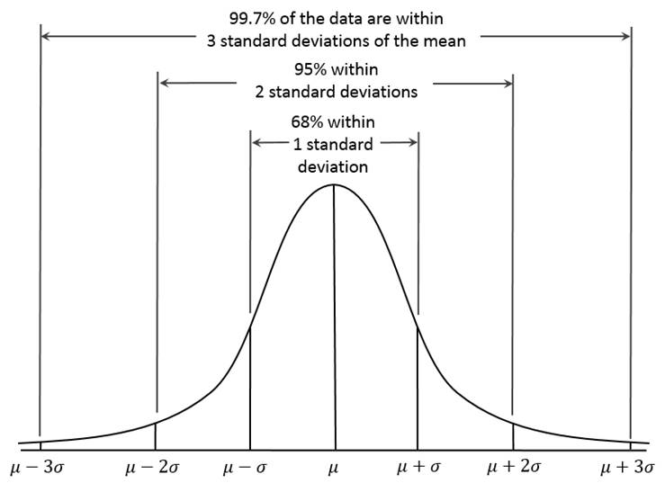
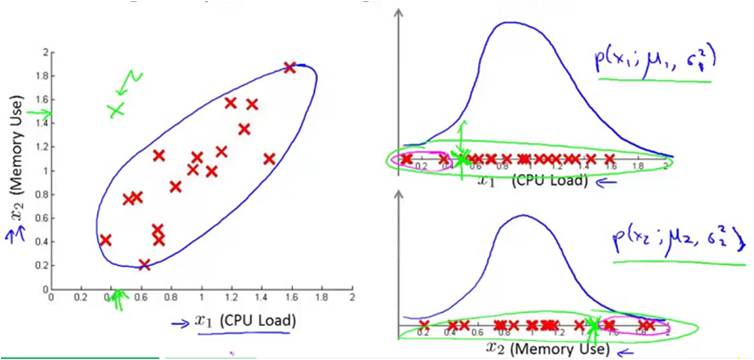
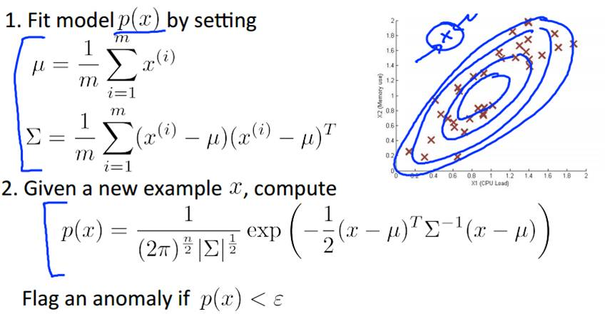

# Anomaly(Outlier)Dection                                     Mark Lin @MLEng Team *Transwarp*
## Definition
* Hawkins - Outlier:
An outlier is an observation that deviates so much from other observations as to arouse suspicion that it was generated by a different mechanism.

## Applications of Anomaly Detection
* Network intrusion detection
* Insurance / Credit card fraud detection
* Healthcare Informatics / Medical diagnostics
* Industrial Damage Detection
* Image Processing / Vedio surveillance
* ...
## Key Challengs
* Defining a representative normal region is challenging
* The boundary between normal and outlying behavior is often not precise
* The exact notion of an outlier is different for different application domains
* Availability of labeled data for training / validation
* Data might contain noise
* Normal behavior keeps evolving
## Contents
* Graphical Approach: Box-plot
* Statistic Approach: Univariate / Multivariate Gaussion Distribution
* Distance-based Approach
* Density-based Approach: LOF
* Model-based Approach: Isolation Forest， RNN
## Box-plot
* The bottom and top of the box are the first and third quartiles
* The band inside the box is the second quartile (the median)
* The lowest datum within 1.5 IQR of the lower quartile, and the highest datum within 1.5 IQR of the upper quartile

## Contents
* Graphical Approach: Box-plot
* Statistic Approach: Univariate / Multivariate Gaussion Distribution
* Distance-based Approach
* Density-based Approach: LOF， RNN
* Model-based Approach: Isolation Forest
## Statistical Approach
* General idea
	* Given a certain kind of statistical distribution (e.g., Gaussian)
	* Compute the parameters assuming all data points have been generated by such a statistical distribution (e.g., mean and standard deviation)
	* Outliers are points that have a low probability to be generated by the overall distribution
* Basic assumption
	* Normal data objects follow a (known) distribution and occur in a high probability region of this model
	* Outliers deviate strongly from this distribution
## Univariate Gaussian Distribution
1. Choose a feature xj that might be indicative of anomalous examples.
2. Fit parameters u1, ..., un, σ12，..., σn2

3. Given new example x, compute p(x):

4. Anomaly if p(x) < ε

## Multivariate Gausssian Distribution

## Problems
* Mean and standard deviation are very sensitive to outliers.
* These values are computed for the complete data set(including potential outliers).
* It is hard to choose a good  ε.
* Data distribution is unknown.
## Contents
*