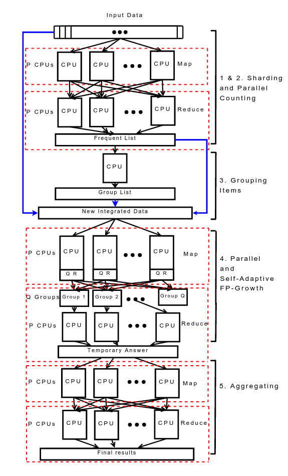

title: "关联规则挖掘基础篇"
date: 2016-07-04 14:46:01
categories: 数据挖掘
tags: [数据挖掘, 关联规则]
---
<center></center>
### 什么是关联规则挖掘？
　　作为数据挖掘的重要研究方向之一，关联规则挖掘的目的是从事务数据集中分析数据项之间潜在的关联关系，揭示其中蕴含的对于用户有价值的模式。一般认为，关联规则挖掘主要由两个步骤组成：(1)从事务数据集中挖掘所有支持度不小于最小支持度阈值的频繁项集；(2)从上一步结果中生成满足最小置信度阈值要求的关联规则。其中，由于具有指数级别的时间复杂度，频繁项集挖掘所消耗的时间往往超过用户可以接受的程度。在过去的十多年中，国内外的研究者们提出了许多算法来不断改进相关算法的性能。这里的性能主要指的是执行时间。
<!-- more -->
### 问题定义
　　<b>定义1</b>（项集）设I={i<sub>1</sub>，i<sub>2</sub>，...，i<sub>n</sub>}是n个不同的数据项组成的集合。包含0个或多个数据项的集合，称之为项集。
　　<b>定义2</b>（k-项集）如果一个项集包含 k个数据项，则称之为k-项集。
　　<b>定义3</b>（事务）事务是不同的数据项组成的集合。每一条事务T是I的一个子集，即T⊆ I。
　　<b>定义4</b>（事务数据集）事务数据集D={T<sub>1</sub>，T<sub>2</sub>，...，T<sub>m</sub>}是m条事务组成的集合。
　　<b>定义5</b>（项集的支持度计数）项集X在D中的支持度计数表示D中包含X的事务数，其形式化定义如下:
<center>count(X)=|{T<sub>i</sub>|X⊆T<sub>i</sub>，T<sub>i</sub>∈D}|</center>
　　其中，|·|表示集合中元素的个数。
　　<b>定义6</b>（项集的支持度）项集X在D中的支持度表示包含X的事务在D中所占的比例，其形式化定义如下:
<center>support(X)=|{T<sub>i</sub>|X⊆T<sub>i</sub>，T<sub>i</sub>∈D}|/|D|</center>
　　<b>定义7</b>（频繁项集）如果项集X的支持度不小于用户给定的最小支持度阈值 minSup，则称X为频繁项集。
　　<b>定义8</b>（候选项集）可能成为频繁项集的项集称为候选项集。
### 问题分析
　　如果一个事务数据集中包含5个{a}，{b}，{c}，{d}，{e}不同的数据项，则该问题的解空间包含2<sup>5</sup>个候选项集，如下图所示。
<div align=center>

</div>
　　为了计算该解空间中每一个候选项集的支持度，Brute-force方法通过扫描事务数据集，将所有候选项集与事务逐一比较。如果事务中包含该候选项集，则增加候选项集的支持度。该过程如下图所示。
<div align=center>

</div>
　　从而，可知Brute-force方法的时间复杂度约为O(NMw)，其中N是事务数据集的大小，M是候选项集的数量，w是平均事务的长度。由于M=2<sup>k</sup>，k是数据项的数量，因此，该方法的时间复杂度是指数级别。
### Apriori算法分析
#### 基本思想
　　Apriori算法采用了逐层搜索的策略来对解空间进行遍历。在遍历的过程中 ，该算法采用了先验原理（*如果一个项集是频繁项集，则其任意子集均是频繁项集。*）来对解空间进行剪枝，减少候选项集的数量。
<div align=center>

</div>
　　给定如上图所示的解空间，如果候选项集{A，B}不是频繁项集，则该候选项集的任意超集均不可能成为频繁项集，因此，无需计算这些项集的支持度，可以将其从解空间中剪枝，减少了不必要的计算量。
#### 算法过程
　　Apriori算法首先扫描一次事务数据集，计算各个数据项的支持度，从而得到频繁1-项集。将这些频繁1-项集自连接来生成候选2-项集。通过再一次扫描事务数据集，计算各个候选项集的支持度，从而得到频繁2-项集。Apriori算法按照这个方式不断迭代，直至不再产生新的候选项集或频繁项集为止。其中，将两个k-项集自连接来生成候选(k+1)-项集的要求是这两个k-项集除了最后一个数据项不同，其余数据项均相同。所生成的不满足先验原理的候选(k+1)-项集将被删除。
<div align=center>

</div>
　　如上图所示，将频繁3-项集{abc}和{abd}做自连接生成候选4-项集{a，b，c，d}，由于{a，b，c，d}的任意子集均是频繁项集，因此，保留该候选项集。而候选4-项集{a，c，d，e}的子集{c，d，e}并不是频繁项集，因此，将其删除。
　　Apriori算法的伪代码如下。
```
initially, scan DB once to get frequent 1-itemset
repeat
　　  generate (k+1)-candidate itemsets from frequent k-itemset
　　  test (k+1)-candidate itemsets against DB to find frequent (k+1)-itemsets
　　  set k := k + 1
until no candidate or frequent itemsets can be generated
return all the frequent itemsets derived
```
　　给定事务数据集TDB，Apriori算法的执行过程如下图所示。
<div align=center>

</div>
　　可知Apriori算法的执行过程需要多次扫描事务数据集，尽管采用了基于先验定理的剪枝技术，仍然需要在内存中保存大量候选项集，另外，计算候选项集的支持度计数所需要的时间开销较大。
### Apriori算法优化策略
#### Hash Tree
　　支持度计数的一种方法是将每个事务与所有的候选项集进行比较，并且更新包含在事务中的候选项集的支持度计数。这种方法是时间开销比较大，尤其当事务和候选项集的数量都很多时。
　　另外一种方法是枚举每个事务所包含的项集，并且利用这些项集来更新对应的候选项集的支持度。该方法通过建立Hash Tree来表示候选项集。建立Hash Tree的伪代码如下。
```
initially, k = 1
m is the maximum number of candidate itemsets of a tree node which is specified by user
for each candidate c in all candidate itemsets 
    compute the hash value v of kth item of c
    insert c to tree node n according to v
    if the number of candidate itemsets of n exceeds m
        k := k + 1
        split n by k
return Hash Tree
```
　　下图是一颗Hash Tree的例子。树的每一个内部节点都使用Hash函数h(x)=x%3来确定应当沿着当前节点的哪个分支向下。候选项集经过多次计算Hash函数后存储在Hash Tree的叶子节点中。
<div align=center>

</div>
　　考虑一条事务t={1，2，3，4，5}，为了更新候选项集的支持度计数，所有包含属于事务t的候选3-项集的叶节点至少访问一次。注意，包含在t中的候选3-项集必然是以数据项{1}，{2}，{3}开始。因此，Hash Tree的根节点将数据项{1}，{2}，{3}分别散列到不同的子节点。在树的下一层，根据事务的第二个数据项进行散列。继续这一过程，直至到达Hash Tree的叶节点。将事务与叶节点中存储的候选项集进行比较，如果候选项集是该事务的子集，则增加它的支持度计数。
<div align=center>

</div>
#### Direct Hashing and Pruning(DHP)
　　Apriori算法在执行过程中需要生成大量候选项集，同时，为了计算这些候选项集的支持度计数需要大量的时间开销。采用DHP技术可以帮助减少候选项集的数量，尤其是在前两轮迭代计算过程中，实验结果表明采用DHP技术后候选项集的数量减少了一个数量级。另外，DHP技术会对事务数据集进行裁剪，有助于减少后续计算的时间开销。
　　下图是采用DHP技术生成候选2-项集的过程。
<div align=center>

</div>
　　DHP技术在计算候选1-项集的支持度计数的同时，对每一条事务所包含的2-项集进行枚举，根据Hash函数将其映射到对应的bucket。每一个bucket记录了其所包含的项集的数量。在生成候选2-项集时，通过查询对应的bucket来过滤不满足最小支持度阈值的候选2-项集。例如，通过Hash函数计算频繁1-项集{A}和{B}自连接生成的候选2-项集{A，B}对应的Bucket，可以发现其不满足最小支持度阈值，因此，无需计算该候选2-项集的支持度计数。
　　对于频繁(k+1)-项集而言，其必然包含(k+1)个频繁k-项集，同时，每一个数据项必然出现了k次。如频繁3-项集{B，C，D}包含3个频繁2-项集{B，C}，{B，D}，{C，D}，其中，{B}，{C}，{D}各分别出现2次。根据这一规律，DHP计数对事务数据集进行裁剪。具体地，在遍历事务数据集来计算候选k-项集的支持度计数时，对于每一条事务，统计每一个数据项在候选项集中出现的次数，并将那些出现次数小于k次的数据项删除。如果删除之后，整条事务的长度小于(k+1)，则将这条事务从事务数据集中删除。
### Apriori算法并行化
　　Apriori算法并行化的基本思想是将生成候选项集的过程和计算候选项集计数的过程交给各个工作节点独立执行。本文简单介绍一下如何采用Spark技术来实现Apriori算法。
　　事务数据集由RDD来表示，计算频繁1-项集的过程如下图所示。
<div align=center>

</div>
　　在接下来的每一轮迭代过程中，各个分区生成的候选项集将被collect到driver端，建立Hash Tree，并通过broadcast的方式将Hash Tree发送到各个worker。每一个executor根据Hash Tree计算分区内候选项集的支持度计数。在具体实现生成候选项集时，共有两种实现方式，其一是调用Spark自带的join方法，其二是采用MapReduce中map side join的方式实现，即将候选项集broadcast到各个worker，每一个executor将当前分区内的候选项集与broadcast变量中的候选项集进行自连接。实验结果表明第二种实现方式更加稳定和高效。
<div align=center>

</div>
### FP-Growth算法分析
#### 基本思想
　　FP-Growth算法采用分而治之的思想，递归地将事务数据集划分为多个更小的条件事务数据集来挖掘频繁项集。同时，采用FP-Tree来表示事务数据集，FP-Tree是一种前缀树的变形，具有较高的压缩性能。FP-Growth算法在执行过程中只需要两次遍历事务数据集，并且不产生候选项集，从而在性能上比Apriori算法快了一个数量级。
#### 算法过程
　　给定如下图所示的事务数据集。首先，FP-Growth算法扫描一次事务数据集，计算各个数据项的支持度计数，从而得到频繁1-项集。然后，再一次扫描事务数据集，根据频繁1-项集对每一条事务进行过滤，删除其中不满足最小支持度阈值的1-项集，并按照支持度计数递减排序。
<div align=center>

</div>
　　FP-Tree的每一个节点存储了数据项的名称，支持度计数和指向同名节点的指针。将上一步处理过后的事务插入到FP-Tree的过程如下图所示（图中未画出指向同名节点的指针）。
<div align=center>

</div>
　　为了便于遍历FP-Tree中的数据项，FP-Growth算法通过建立头表（header table）来记录每一个数据项的支持度计数和指针，如下图所示。
<div align=center>

</div>
　　概括地讲，FP-Growth算法挖掘频繁项集的过程由两个子过程组成。其一，是遍历事务数据集并建立FP-Tree。其二，是对于该FP-Tree对应的头表中的每一个数据项，通过遍历同名节点链表来生成数据项的条件事务数据集。该算法通过递归地执行上述两个子过程来挖掘频繁项集，如下图所示。
<div align=center>

</div>
### FP-Growth算法优化策略
#### FP-Array
　　在FP-Growth算法挖掘频繁项集的过程中，每一次递归都需要两次遍历FP-Tree。第一次是通过遍历FP-Tree生成条件事务数据集，第二次是根据条件事务数据集建立条件FP-Tree。尽管采用FP-Tree来表示事务数据集具有较高的压缩性能，但是，当FP-Tree所包含的节点数量较多时，遍历FP-Tree所需的时间明显增加。采用FP-Array技术后，每一次递归可以只需要一次遍历，进一步提高了FP-Growth算法的性能。
　　下面将介绍如何采用FP-Array技术来改进FP-Growth算法。给定事务数据集如下图所示。与FP-Growth算法相同，将所有事务进行过滤和排序，然后插入到FP-Tree中。
<div align=center>

</div>
　　与FP-Growth算法不同之处在于，将每一条事务插入到FP-Tree的过程的同时，需要额外构建了一个二维矩阵，称之为FP-Array，来记录与每一个数据项共同出现的数据项的支持度计数，如下图所示。
<div align=center>

</div>
　　例如上图中第三行表示与数据项{g}共同出现的数据项{b}、{a}、{d}的支持度计数分别为3、2、3。需要注意的是，无需考虑比数据项{g}支持度计数更低的数据项，例如{f}、{e}，因为这些项在下一次递归计算时并不起任何作用。所以，改进后的FP-Growth算法只需要扫描FP-Array就可以生成条件事务数据集。因此，与原FP-Growth算法相比，每一次递归的计算量均减少了一半的遍历FP-Tree的时间。
### FP-Growth算法并行化
　　对于FP-Growth算法并行化的研究主要依赖于并行计算框架。其中，较为典型的代表是由北京谷歌研究中心Li Haoyuan在MapReduce框架上实现的PFP算法，其执行流程如下图所示。
<div align=center>

</div>
　　该算法共执行三次Map和Reduce方法来查找事务数据集中的频繁项集。第一次执行Map和Reduce方法的目的是统计每一个数据项在事务数据集中出现的次数。删除不满足阈值的数据项后，按照支持度计数递减排序。然后,将上述计算结果分组，并为每一个组分配一个唯一的id。分组数量和分组策略的合理性都对该算法的性能有着直接影响。其中,分组数量由用户指定。为了均衡各个工作节点的工作负载，该算法采用了基于哈希的分组策略，并将分组结果通过分布式缓存技术(Distributed Cache)传输到各个工作节点。第二次执行Map和Reduce方法的目的是生成条件事务数据集和查找条件事务数据集中包含的频繁项集。其中，Map方法的输入是事务数据集的一个分区。对于分区中的每一条事务，该算法将根据分组结果来生成其对应的条件事务，将其写入到磁盘上，并作为Reduce方法的输入，如下图所示。Reduce方法从集群的其他工作节点的磁盘上拉取当前组对应的所有条件事务，将其作为新的事务数据集，通过执行单机FP-Growth算法来挖掘其中包含的所有频繁项集。第三次执行Map和Reduce方法最终汇总所有工作节点的计算结果。
<div align=center>

</div>
　　在Spark MLlib中也有FP-Growth算法的实现。该算法总体思路上与PFP算法相同，不同之处在于对shuffle进行了优化。PFP算法中shuffle的条件事务数据集可以理解为数组。但是，Spark MLlib在shuffle之前基于条件事务数据集建立了FP-Tree，因此，shuffle的是FP-Tree。由于FP-Tree具有较好的压缩性能，尽管建立FP-Tree时牺牲了一点时间，但是，当需要shuffle的数据量较大时，Spark MLlib中实现的FP-Growth算法确实具有较好的效果。然而，该实现仍然存在比较明显的缺点，有兴趣的读者可以通过阅读源码来思考一下这个问题。

```
/**
  * Computes an FP-Growth model that contains frequent itemsets.
  * @param data input data set, each element contains a transaction
  * @return an [[FPGrowthModel]]
  *
  */
@Since("1.3.0")
def run[Item: ClassTag](data: RDD[Array[Item]]): FPGrowthModel[Item] = {
    if (data.getStorageLevel == StorageLevel.NONE) {
        logWarning("Input data is not cached.")
    }
    val count = data.count()
    // 最小支持度阈值minCount
    val minCount = math.ceil(minSupport * count).toLong 
    val numParts = if (numPartitions > 0) numPartitions else data.partitions.length
    // 采用HashPartitioner来对数据项进行分组
    val partitioner = new HashPartitioner(numParts)
    // 计算频繁1-项集
    val freqItems = genFreqItems(data, minCount, partitioner)
    // 挖掘所有频繁项集
    val freqItemsets = genFreqItemsets(data, minCount, freqItems, partitioner)
    new FPGrowthModel(freqItemsets)
}

/**
  * Generate frequent itemsets by building FP-Trees, the extraction is done on each partition.
  * @param data transactions
  * @param minCount minimum count for frequent itemsets
  * @param freqItems frequent items
  * @param partitioner partitioner used to distribute transactions
  * @return an RDD of (frequent itemset, count)
  */
private def genFreqItemsets[Item: ClassTag](
        data: RDD[Array[Item]],
        minCount: Long,
        freqItems: Array[Item],
        partitioner: Partitioner): RDD[FreqItemset[Item]] = {
        val itemToRank = freqItems.zipWithIndex.toMap
    data.flatMap { transaction =>
        genCondTransactions(transaction, itemToRank, partitioner) // 生成候选项集
    }.aggregateByKey(new FPTree[Int], partitioner.numPartitions)(
        (tree, transaction) => tree.add(transaction, 1L), // 在Map端建立FP-Tree
        (tree1, tree2) => tree1.merge(tree2)) // 在Reduce端合并FP-Tree
    .flatMap { case (part, tree) =>
        tree.extract(minCount, x => partitioner.getPartition(x) == part) // 递归挖掘所有频繁项集
    }.map { case (ranks, count) =>
        new FreqItemset(ranks.map(i => freqItems(i)).toArray, count)
    }
  }
```
### 结束语
　　本文从时间复杂度角度引入对频繁项集挖掘问题的分析，概要地介绍了两种常见的频繁项集挖掘算法Apriori算法和FP-Growth算法，并对它们的优化策略和并行化方法进行了介绍。


