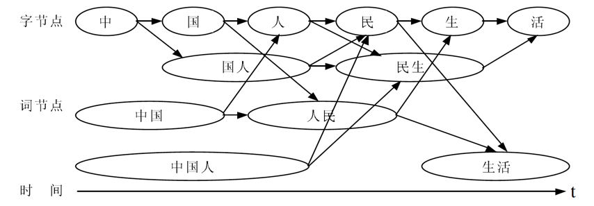
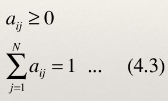
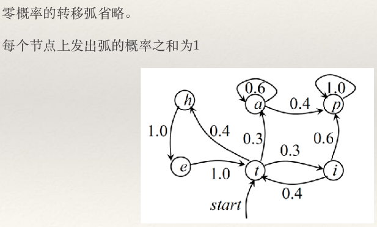
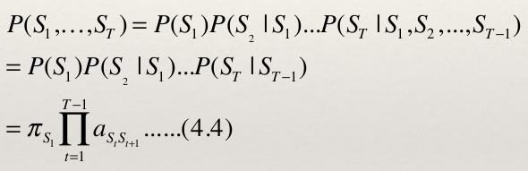
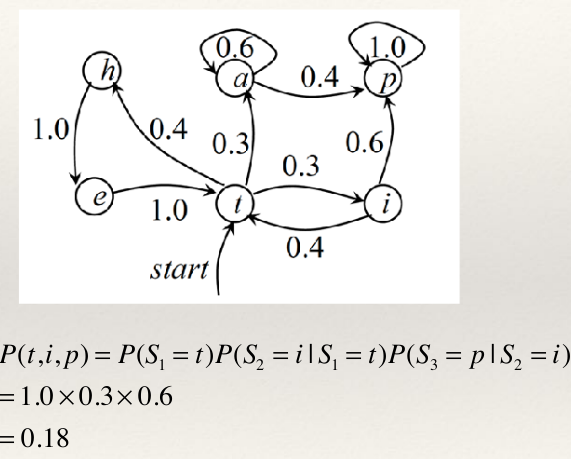
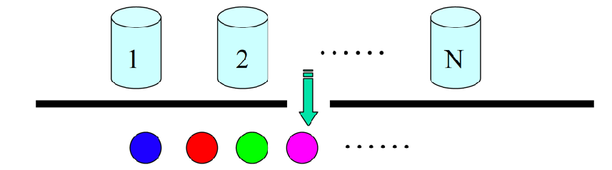
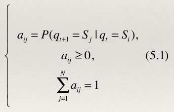
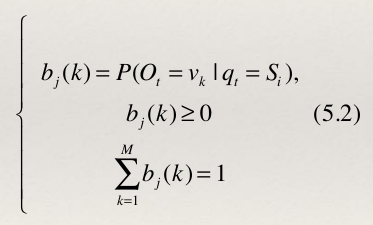
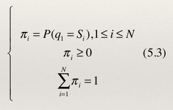

# 目录
1. 分词的定义
2. 分词的难点
3. 分词的方法
4. 马儿可夫模型介绍
5. 隐马儿可夫模型介绍
6. 总结

# 分词的定义
 + 词是自然语言中最小的有意义的构成单位。汉语文本是基于单字的,汉语的书面表达方式也是以汉字作为最小单位的,词与词之间没有显性的界限标志,因此分词是汉语文本分析
处理中首先要解决的问题之一。
 + 对于大多数汉语处理系统来讲,第一步要进行的就是识别这些隐含的词语边界,即添加合适的显性的词语边界标志使得所形成的词串反映句子的本意。这个过程就是通常所说的分词。

# 分词的难点

+ __如何识别未登录词__
  + 常见的未登录词有如下几类:1)专有名词,包括中文人名(如“朱镕基总理”)、地名(如“綦江县”)、机构名称(如“杭州娃哈哈集团公司”)、外国译名(如“克鲁普总统”)、时间词(如“2022年5月26日”);2)重叠词,如“高高兴兴”、“研究研究”;3)派生词,如“一次性用品”;4)与领域相关的术语,如“高斯分布”。
  + 一个鲁棒性的系统必须能很好的识别未登录词,但是到目前为止,现有的方法都很难完美。

+ __如何廉价的获取语言学知识__
  + 一方面,目前还没有一个可以利用的大规模的汉语分词语料,而人工加工一个大规模的分词语料是一种耗费很大的工作;
  + 一方面,任一汉字对间都可能是一个词语边界,而且分词直接面对的是词,参数空间巨大,特别是高阶模型,目前还没有适用于分词的完全有效的无监督的参数学习方法。

# 分词的难点

## 词语边界歧义
+ 词语边界歧义指的是对于一个给定的汉语句子或汉字串,有多种词语边界划分形式。汉语词语边界歧义包括组合歧义和交叉歧义。
+ 组合歧义是不同的组合方式。如句子“以/我/个人/的/名义/”和“他/一/个/人/在家/”的“个人”是一个组合歧义字段。
+ 交叉歧义还可细分为真歧义和伪歧义。真歧义指存在两种或两种以上的可实现的切分形式,如句子“必须/加强/企业/中/国有/资产/的/管理/”和“中国/有/能力/解决/香港/问题/”中的字段“中国有”是一种真歧义;而伪歧义一般只有一种正确的切分形式,如“建设/有”、“中国/人民”、“各/地方”、 “本/地区”等。
+ 在这些歧义中,伪歧义字段的切分结果是上下文无关的,一般仅依据字段内部的信息如词频或字间互信息就可正确切分伪歧义字段,而真歧义字段或组合歧义字段的结果依赖于它所处的上下文环境,因而正确处理真歧义字段,常常需要更多的信息,特别是上下文信息。
## 分词效率问题
+ 大多数分词系统只注重识别准确率,而忽视了识别速度。有些应用系统,如机助翻译系统,其实时性能要求较高,要求分析算法对输入句子能做出迅速准确的处理。
+ 对于给定的输入句子,其可能的切分词串数量与句子长度成指数关系,因为在理论上句子中的任何一个汉字串都可以成为一个词。已被证明,最坏情况下的穷举搜索算法实际并不可行。贪心算法虽然能避免组合爆炸,但它不能保证输出结果最佳。可见,识别算法的效率在实时性应用系统中地位非常重要。

# 分词的方法

## 正向最大分配分词
+ 最大正向匹配(FMM)的基本思想是:假设自动分词词典中的最长词条所含汉字个数为I,则取被处理材料当前字符串序数中的I个字作为匹配字段,查找分词词典。若词典中有这样的一个I字词,则匹配成功,匹配字段作为一个词被切分出来;如果词典中找不到这样的一个I字词,则匹配失败。匹配字段去掉最后一个汉字,剩下的字符作为新的匹配字段,进行新的匹配,如此进行下去,直至切分成功为止。即完成一轮匹配切分出一个词,然后再按上面的步骤进行下去,直到切分出所有词为止。
+ 例如现有短语“计算机科学和工程”,假设词典中最长词为7字词,于是先取“计算机科学和工”为匹配字段,来查找分词词典以匹配这个字段,由于词典中没有该词,故匹配失败,去掉最后一个汉字成为“计算机科学和”作为新的匹配字段,重新匹配词典,同样匹配失败,取“计算机科学”作为新的匹配字段,来匹配词典,由于词典中有“计算机科学”一词,从而匹配成功,切分出第一个词“计算机科学”。同样的方法还可以切分出后续的词。
+ 这种方法进行分词的时候,对上文提到的交叉歧义和组合歧义没有什么好的办法。因为对组合歧义才说,通常他都会作为一个分词单位,如“市场中国有企业才能发展”这个例句中,按照正向最大匹配分词方法,切分方法为“市场/中国/有/企业/才能/发展/” 我们可以看到,在这个例句中,有两个分词错误,分别为“中国/有”这个交叉歧义和“才能”这个分词的组合歧义。

## 反向最大匹配分词
+ 与FMM方法相对应的方法是反向最大匹配分词方法,也称为BMM方法。它的分词过程与FMM方法相同,不过是从句子(或文章)末尾开始处理,每次匹配不成功时去掉的是前面的一个汉字。
+ 如“计算机科学和工程”,首先取“计算机科学和工程”作为匹配字段来匹配分词词典,由于词典中没有该词,故匹配失败。去掉最前面的一个汉字,即取“算机科学和工程”作为新的匹配字段,进行匹配,同样的匹配失败,......,最后,取“工程”作为匹配字段,来匹配分词词典,由于分词词典中有“工程”一词,则匹配成功,切分出第一个词“工程”。
+ 例如上面方法中“市场中国有企业才能发展”这个例句中,按照反向最大匹配分词方法,切分方法为“市场中/国有/企业/才能/发展/” 我们可以看到,在这个例句中,有一个分词错误,那就是才能这个分词的组合歧义,应该切分为 “才/能”才可以。
## 基于统计的词网分词
+ 与基于词网格分词的第一步是候选词网格构造:利用词典匹配,列举输入句子所有可能的切分词语,并以词网格形式保存。实际上,词网格是一个有向无环图,它蕴含了输入句子所有可能的切分,其中的每一条路径代表一种切分。如下图“中国人民生活“的切分词网:

+ 词网分词的第二步是计算词网格中的每一条路径的权值,权值通过计算图中每一个节点(每一个词)的一元统计概率和节点之间的二元统计概率的相关信息。然后根据图搜索算法在图中找到一条权值最小的路径,对应的路径即为最后的分词结果。

# 马尔可夫模型
## 马尔科夫模型的描述
+ 存在一类重要的随机过程:如果一个系统有N个状态S 1 ,S 2 , ... , S N , 随时间的推移,该系统从某一状态转移到另一状态。系统在时间t 的状态记为q t 。系统在时间t 处于状态S j (1≤j≤N) 的概率取决于其在时间1, 2, ..., t-1 的状态,该概率为:P(q t = S j | q t−1 = S i ,q t−2 = S k ,...)
+ 假设1
+ 如果在特定情况下,系统在时间t的状态只与时间t-1的的状态相关,则该系统构成一个离散的一阶马尔可夫链:
P(q t = S j | q t−1 = S i ,q t−2 = S k ,...) =P(q t = S j | q t−1 = S i ) ...(4.1)
+ 假设2
+ 如果只考虑公式(4.1)独立于时间t的随机过程,即不动性假设,状态与时间无关,那么:
P(q t = S j | q t−1 = S i ) = a ij , 1 ≤ i, j ≤ Ν ...(4.2)
+ 该随机过程称为马尔可夫模型。其中a ij 表示转移概率。
+ 在马尔可夫模型中,状态转移概率a ij 必须满足下面的要求:

+ 马尔可夫模型可以视为随机有限状态自动机,该有限状态自动机的每一个状态转换过程都有一个相应的概率,该概率表示自动机采用这一状态转换的可能性。
+ 马尔可夫模型链可以表示成状态图(即转移弧上有概率的非确定的有限状态自动机)。

+ 状态序列S 1 ,... ,S T 的概率:

# 隐马尔可夫模型
__5.1 描述__
+ 隐马尔可夫模型是一个双重随机过程,我们不知道具体的状态序列,只知道状态转移的概率,即模型的状态转换过程是不可观察的(隐藏的),而可观察的事件的随机过程是隐藏的状态转换过程的随机函数。
__5.2 举例__
+ 假设有N 个袋子,每个袋子中有M 种不同颜色的球。实验员根据某一概率分布选择一个袋子,然后根据袋子中不同颜色球的概率分布随机取出一个球,并报告该球的颜色。对局外人:可观察的过程是不同颜色球的序列,而袋子的序列是不可观察的。每只袋子对应HMM 中的状态;球的颜色对应于HMM 中的状态的输出。

__5.3 组成__
+ (1) 模型中的状态数为N (袋子的数量)
+ (2) 从每一个状态可能输出的不同的符号数M(不同颜色球的数目
+ (3) 状态转移矩阵:状态转移矩阵A=a ij (a ij 为实验员从一只袋子转向另外一只袋子取球的概率)。

+ (4) 生成概率矩阵。从状态S j 观察到某一特定符号v k 的概率分布矩阵为:B=b j (k)。其
中b j (k)为实验员从第j个袋子中取出第k种颜色的球的概率。那么:

+ (5) 初始状态的概率分布:初始状态的概率分布 π = π i ,其中,

为了方便,一般将HMM 记为:μ (A, B, π ) 用以指出模型的参数集合。

__5.4 观察序列的生成__
+ 给定模型 μ (A, B, π ) ,观察序列 O = O 1 ,...,O T 产生的步骤如下:
+ (1)初始化t为1
+ (2)根据初始状态概率分布 π = π i 选择一初始状态q 1 =S i ;
+ (3)根据状态S i 的生成概率分布b i (k), 输出O t =v k ;
+ (4)t = t+1, 如果t < T, 重复步骤(3) (4),否则结束。

__5.5 三个问题__
+ 问题1:在给定模型 μ (A, B, π ) 和观察序列 O = O 1 ,...,O T 的情况下,怎样快速计
算 p(O | μ ) ?
+ 问题2:在给定模型 μ (A, B, π ) 和观察序列 O = O 1 ,...,O T 的情况下,如何选择在一定意义
下“最优”的状态序 Q = q 1 ,...,q T ,使得该状态序列“最好地解释”观察序列。
+ 问题3:给定一个观察序列 O = O 1 ,...,O T ,如何根据最大似然估计来求模型的参数值?
即如何调节模型 μ (A, B, π ) 的参数,使得 p(O | μ ) 最大?

 

