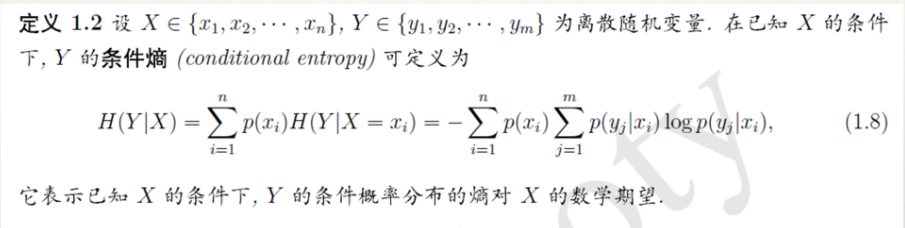

# 最大熵模型

## 目录
+ 1.什么是最大熵模型
+ 2.相关数学知识
+ 3.最大熵模型的定义
+ 4.最大熵模型的学习
+ 5.最优化算法
+ 6.参考资料

## 1.什么是最大熵原理

+ 例子1:假设随机变量X有5个取值{A,B,C,D,E},要估计各个值的概率P(A),P(B),...,P(E).
+ 这些概率值满足条件P(A)+P(B)+P(C)+P(D)+P(E)=1
+ 但是满足这个条件的概率分布有无数个。如果没有其他信息,一个可行的办法就是认为他们的概率都相等,均为0.2。
+ 如果再加一个条件P(A) + P(B) = 0.3,那么各个值的概率为多少?

## 2.数学知识
+ __拉格朗日乘子法__

+ __Bayes定理__
  - Bayes定理用来描述两个条件概率之间的关系。若计P(A)和P(B)分别表示事件A和事件B发生的概率,P(A|B)表示事件B发生的情况下事件A发生的概率,P(A,B)表示事件A和B同时发生的概率,则有:

利用(1.2)和(1.3)可以进一步得到贝叶斯公式:

+ __熵__
  - 熵(entropy)是热力学中的概念,由香浓引入到信息论中。在信息论和概率统计中,熵用来表示随机变量不确定性的度量。

  - H(x)依赖于X的分布,而与X的具体值无关。H(X)越大,表示X的
不确定性越大。

+ __条件熵__

## 3.最大熵模型的定义

+ 最大熵原理是统计学习的一般原理,将它应用到分类就得到了最大熵模型
+ 假设分类模型是一个条件概率分布P(Y|X),X表示输入,Y表示输出。这个模型表示的是对于给定的输入X,以条件概率P(Y|X)输出Y。
+ 给定一个训练数据集T,我们的目标就是利用最大熵原理选择最好的分类模型。

+ 按照最大熵原理,我们应该优先保证模型满足已知的所有约束。那么如何得到这
些约束呢?
+ 思路是:从训练数据T中抽取若干特征,然后要求这些特征在T上关于经验分布
的期望与它们在模型中关于p(x,y)的数学期望相等,这样,一个特征就对应一个
约束。

