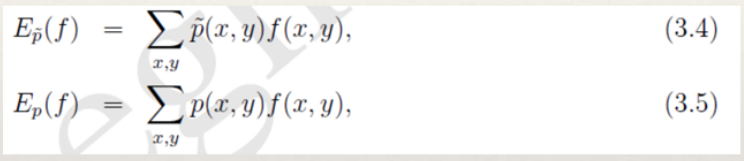
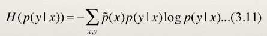

# 最大熵模型

## 目录
+ 1.什么是最大熵模型
+ 2.相关数学知识
+ 3.最大熵模型的定义
+ 4.最大熵模型的学习
+ 5.最优化算法
+ 6.参考资料

## 1.什么是最大熵原理

+ 例子1:假设随机变量X有5个取值{A,B,C,D,E},要估计各个值的概率P(A),P(B),...,P(E).
+ 这些概率值满足条件P(A)+P(B)+P(C)+P(D)+P(E)=1
+ 但是满足这个条件的概率分布有无数个。如果没有其他信息,一个可行的办法就是认为他们的概率都相等,均为0.2。
+ 如果再加一个条件P(A) + P(B) = 0.3,那么各个值的概率为多少?

## 2.数学知识
+ __拉格朗日乘子法__

+ __Bayes定理__
  - Bayes定理用来描述两个条件概率之间的关系。若计P(A)和P(B)分别表示事件A和事件B发生的概率,P(A|B)表示事件B发生的情况下事件A发生的概率,P(A,B)表示事件A和B同时发生的概率,则有:

利用(1.2)和(1.3)可以进一步得到贝叶斯公式:

+ __熵__
  - 熵(entropy)是热力学中的概念,由香浓引入到信息论中。在信息论和概率统计中,熵用来表示随机变量不确定性的度量。

  - H(x)依赖于X的分布,而与X的具体值无关。H(X)越大,表示X的
不确定性越大。

+ __条件熵__

## 3.最大熵模型的定义
+ 最大熵原理是统计学习的一般原理,将它应用到分类就得到了最大熵模型
+ 假设分类模型是一个条件概率分布P(Y|X),X表示输入,Y表示输出。这个模型表示的是对于给定的输入X,以条件概率P(Y|X)输出Y。
+ 给定一个训练数据集T,我们的目标就是利用最大熵原理选择最好的分类模型。

+ 按照最大熵原理,我们应该优先保证模型满足已知的所有约束。那么如何得到这些约束呢?
+ 思路是:从训练数据T中抽取若干特征,然后要求这些特征在T上关于经验分布的期望与它们在模型中关于p(x,y)的数学期望相等,这样,一个特征就对应一个约束。

### 特征函数

### 经验分布
+ 经验分布是指通过训练数据T上进行统计得到的分布。我们需要考察两个经验分布,分别是x,y的联合经验分布以及x的分布。其定义如下:

+ (3.3)中count(x,y)表示(x,y)在数据T中出现的次数,count(x)表示x在数据T中出现的次数。
### 约束条件
+ 对于任意的特征函数f,记 E p ! ( f ) 表示f在训练数据T上关于 p ! (x, y) 的数学
期望。 E p ( f ) 表示f在模型上关于p(x,y)的数学期望。按照期望的定义,有:

+ 我们需要注意的是公式(3.5)中的p(x,y)是未知的。并且我们建模的
目标是p(y|x),因此我们利用Bayes定理得到p(x,y)=p(x)p(y|x)。
此时,p(x)也还是未知,我们可以使用经验分布对p(x)进行近似。

+ 对于概率分布p(y|x),我们希望特征f的期望应该和从训练数据中得到的特征期望是一样的。因此,可以提出约束:

+ 假设从训练数据中抽取了n个特征,相应的便有n个特征函数以及n个约束条件。

### 最大熵模型
+ 给定数据集T,我们的目标就是根据最大熵原理选择一个最优的分类器。
+ 已知特征函数和约束条件,我们将熵的概念应用到条件分布上面去。我们采用条件熵。

+ 至此,我们可以给出最大熵模型的完整描述了。对于给定的数据集T,特征函数f i (x,y),i=1,...,n,最大熵模型就是求解模型集合C中条件熵最大的模型:

## 最大熵模型的学习
+ 最大熵模型的学习过程就是求解最大熵模型的过程。求解约束最优化问题(3.12),(3.13)所得的解就是最大熵模型学习的解。思路如下:
+ 利用拉格朗日乘子法将最大熵模型由一个带约束的最优化问题转化为一个与之等价的无约束的最优化问题,它是一个min max问题。
+ 利用对偶问题的等价性,将原始问题转换为一个max min问题。

